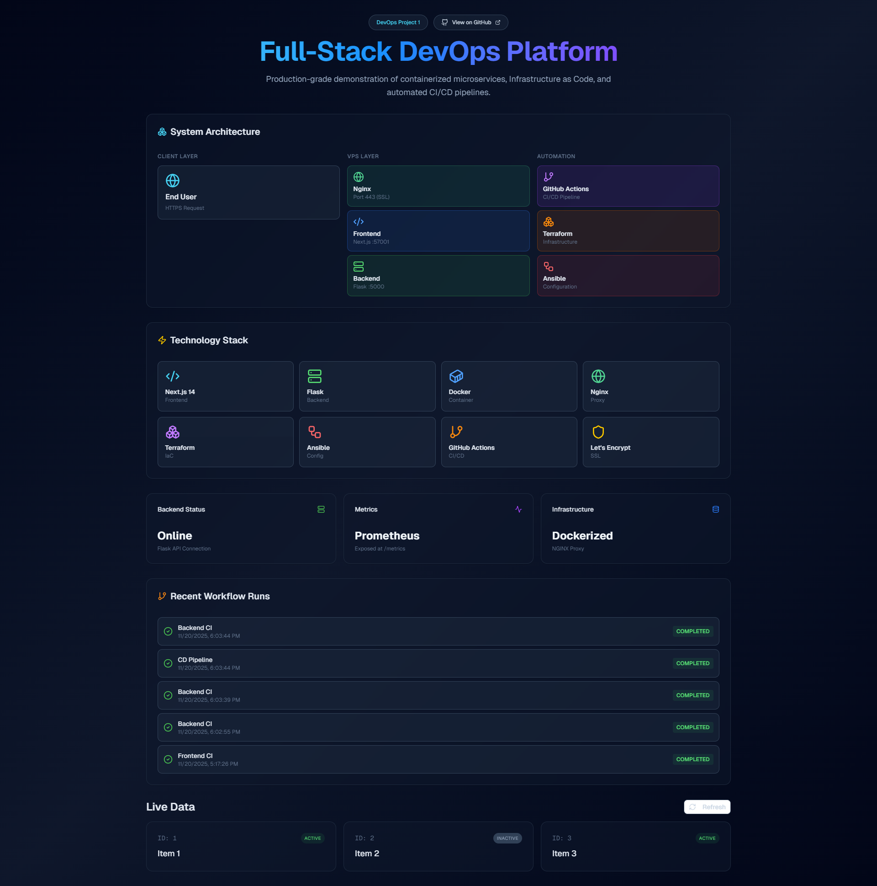
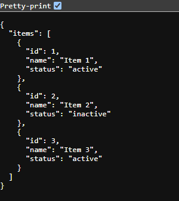
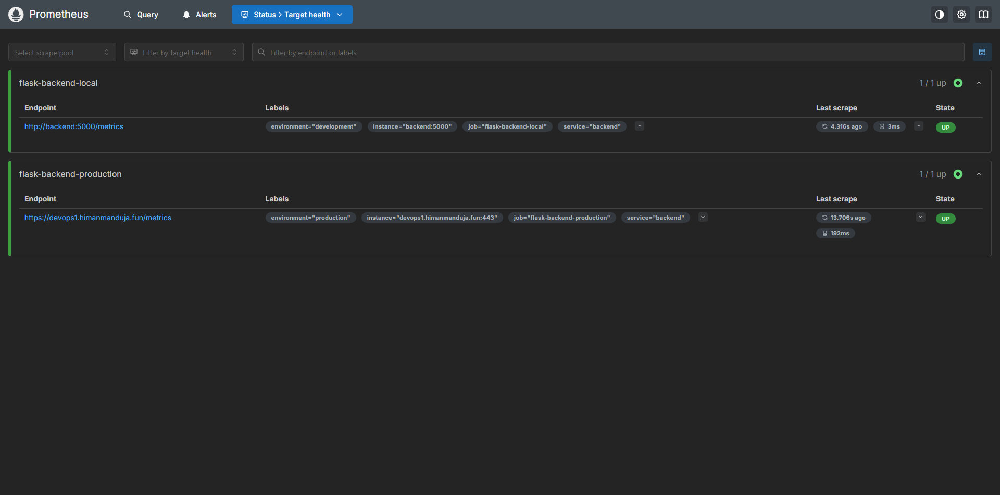
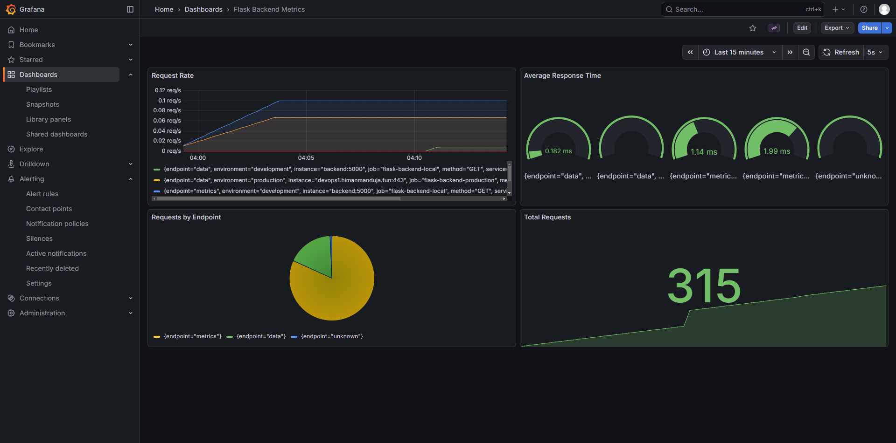

# Full-Stack DevOps Platform

> A production-grade demonstration of modern DevOps practices, featuring containerized microservices, Infrastructure as Code (IaC), and automated CI/CD pipelines.

[](https://github.com/HimanM/DevOps-Project-1/actions/workflows/backend-ci.yml)
[](https://github.com/HimanM/DevOps-Project-1/actions/workflows/frontend-ci.yml)
[](https://github.com/HimanM/DevOps-Project-1/actions/workflows/infra-setup.yml)
[](https://github.com/HimanM/DevOps-Project-1/actions/workflows/deploy.yml)

## 📋 Table of Contents

- [Overview](#overview)
- [Architecture](#architecture)
- [Technology Stack](#technology-stack)
- [Features](#features)
- [Project Structure](#project-structure)
- [Getting Started](#getting-started)
- [CI/CD Pipeline](#cicd-pipeline)
- [Infrastructure as Code](#infrastructure-as-code)
- [Deployment](#deployment)
- [Monitoring](#monitoring)
- [Development](#development)

---

## Overview

This project demonstrates a complete DevOps workflow for deploying a full-stack application to a production VPS. It showcases industry-standard practices including containerization, orchestration, automated testing, continuous deployment, and infrastructure automation.

**Key Highlights:**
- **Microservices Architecture** with Docker containerization
- **Automated CI/CD** using GitHub Actions
- **Infrastructure as Code** with Terraform and Ansible
- **Reverse Proxy & SSL** with Nginx and Certbot
- **Container Registry** integration with GitHub Container Registry (GHCR)
- **Production Deployment** to Ubuntu VPS with zero-downtime updates
- **Monitoring Stack** with Prometheus and Grafana



---

## Architecture

### System Architecture Diagram

```mermaid
graph TB
    subgraph "Client Layer"
        User[End User]
    end
    
    subgraph "VPS - Ubuntu Server"
        Nginx[Nginx Reverse Proxy<br/>Port 443 HTTPS]
        
        subgraph "Docker Network - app-internal"
            Frontend[Next.js Frontend<br/>Container Port 3000<br/>Host Port 57001]
            Backend[Flask Backend<br/>Container Port 5000]
        end
        
        Certbot[Certbot<br/>SSL Certificate Management]
    end
    
    subgraph "CI/CD Pipeline - GitHub Actions"
        CI[CI Workflows<br/>Lint & Test]
        CD[CD Workflow<br/>Build & Deploy]
        Infra[Infrastructure Setup<br/>Ansible & Terraform]
    end
    
    subgraph "Container Registry"
        GHCR[GitHub Container Registry<br/>ghcr.io]
    end
    
    User -->|HTTPS Request| Nginx
    Nginx -->|Proxy Pass| Frontend
    Frontend -->|Internal API Calls| Backend
    Certbot -.->|Manages SSL| Nginx
    
    CI -->|Push Images| GHCR
    CD -->|Pull & Deploy| Frontend
    CD -->|Pull & Deploy| Backend
    Infra -->|Configure| Nginx
    Infra -->|Provision| VPS
    
    style Nginx fill:#2d3748,stroke:#4299e1,stroke-width:2px
    style Frontend fill:#1a365d,stroke:#63b3ed,stroke-width:2px
    style Backend fill:#1a365d,stroke:#63b3ed,stroke-width:2px
    style GHCR fill:#2d3748,stroke:#48bb78,stroke-width:2px
```



### Request Flow

1. **User Request** → HTTPS request to domain (e.g., `https://example.com`)
2. **Nginx** → Terminates SSL, proxies to Frontend container on port 57001
3. **Frontend** → Serves Next.js application, makes internal API calls to Backend
4. **Backend** → Processes requests, returns JSON responses
5. **Response** → Flows back through the chain to the user

---

## Technology Stack

### Frontend
| Technology | Purpose | Version |
|------------|---------|---------|
| **Next.js** | React framework with SSR/SSG | 14.x (App Router) |
| **TypeScript** | Type-safe JavaScript | 5.x |
| **Tailwind CSS** | Utility-first CSS framework | 3.x |
| **Framer Motion** | Animation library | Latest |
| **Shadcn UI** | Component library | Latest |

### Backend
| Technology | Purpose | Version |
|------------|---------|---------|
| **Flask** | Python web framework | 3.x |
| **Prometheus Client** | Metrics exposition | Latest |
| **Python** | Runtime environment | 3.11+ |

### DevOps & Infrastructure
| Technology | Purpose | Use Case |
|------------|---------|----------|
| **Docker** | Containerization | Package applications with dependencies |
| **Docker Compose** | Container orchestration | Multi-container application management |
| **Nginx** | Reverse proxy & web server | SSL termination, request routing |
| **Certbot** | SSL certificate management | Automated Let's Encrypt certificates |
| **Terraform** | Infrastructure as Code | Declarative infrastructure provisioning |
| **Ansible** | Configuration management | Server setup and software installation |
| **GitHub Actions** | CI/CD automation | Automated testing, building, and deployment |
| **GitHub Container Registry** | Container registry | Docker image storage and distribution |

### Deployment Platform
- **Ubuntu VPS** (DigitalOcean/AWS/Linode compatible)
- **SSH** for remote access and automation
- **systemd** for service management (via Docker)

---

## Features

### ✅ Continuous Integration (CI)
- **Automated Linting** for code quality
- **Unit Testing** with pytest (Backend)
- **Build Validation** for Next.js (Frontend)
- **Parallel Execution** for faster feedback
- **Branch Protection** via status checks

### ✅ Continuous Deployment (CD)
- **Automated Image Building** on push to `main`
- **Multi-stage Docker Builds** for optimized images
- **Container Registry Push** to GHCR
- **Zero-Downtime Deployment** with `docker compose pull`
- **Automated Rollout** to production VPS

### ✅ Infrastructure Automation
- **One-Click Provisioning** via GitHub Actions workflow
- **Idempotent Configuration** with Ansible playbooks
- **Declarative Infrastructure** with Terraform
- **SSL Certificate Automation** with Certbot
- **Environment Variable Management** via GitHub Secrets

### ✅ Security
- **HTTPS Enforcement** with automatic certificate renewal
- **Internal Docker Network** for service isolation
- **No Exposed Backend Ports** (only accessible via Frontend proxy)
- **SSH Password Authentication** (configurable for key-based auth)
- **Secrets Management** via GitHub encrypted secrets

---

## Project Structure

```
.
├── .github/
│   └── workflows/
│       ├── backend-ci.yml          # Backend CI pipeline
│       ├── frontend-ci.yml         # Frontend CI pipeline
│       ├── deploy.yml              # CD pipeline (build & deploy)
│       └── infra-setup.yml         # Infrastructure provisioning
│
├── ansible/
│   ├── playbook.yml                # Server configuration playbook
│   ├── nginx.conf.j2               # Nginx configuration template
│   ├── inventory.ini               # Ansible inventory (example)
│   └── ansible.cfg                 # Ansible configuration
│
├── backend/
│   ├── app.py                      # Flask application
│   ├── test_app.py                 # Pytest test suite
│   ├── requirements.txt            # Python dependencies
│   └── Dockerfile                  # Backend container image
│
├── frontend/
│   ├── src/
│   │   └── app/
│   │       └── page.tsx            # Main application page
│   ├── next.config.ts              # Next.js configuration
│   ├── package.json                # Node.js dependencies
│   └── Dockerfile                  # Frontend container image (multi-stage)
│
├── terraform/
│   ├── main.tf                     # Terraform configuration
│   └── terraform.tfvars.example    # Example variables file
│
├── guides/
│   └── setup_guide.md              # Detailed setup instructions
│
├── monitoring/
│   ├── prometheus.yml              # Prometheus configuration
│   └── grafana/                    # Grafana provisioning
│
├── doc/                            # Documentation images
│
├── docker-compose.yml              # Production compose file (GHCR images)
├── docker-compose.local.yml        # Local development compose file
├── docker-compose.monitoring.yml   # Monitoring stack compose file
└── README.md                       # This file
```

---

## Getting Started

### Prerequisites

- **Docker** (20.10+) and **Docker Compose** (v2+)
- **Node.js** (20.x) for local frontend development
- **Python** (3.11+) for local backend development
- **Terraform** (1.5+) for infrastructure provisioning
- **Ansible** (2.15+) for server configuration
- **Ubuntu VPS** with root access (for production deployment)

### Local Development

1. **Clone the Repository**
   ```bash
   git clone https://github.com/yourusername/devops-project.git
   cd devops-project
   ```

2. **Start the Application**
   ```bash
   docker compose -f docker-compose.local.yml up -d --build
   ```

3. **Access the Application**
   - Frontend: [http://localhost:57001](http://localhost:57001)
   - Backend API: [http://localhost:57001/api/data](http://localhost:57001/api/data)
   - Metrics: [http://localhost:57001/metrics](http://localhost:57001/metrics)

   

4. **View Logs**
   ```bash
   docker logs frontend -f
   docker logs backend -f
   ```

5. **Stop the Application**
   ```bash
   docker compose -f docker-compose.local.yml down
   ```

---

## CI/CD Pipeline

### Workflow Overview

```mermaid
graph LR
    A[Push to Branch] --> B{Branch?}
    B -->|Feature Branch| C[Run CI]
    B -->|Main Branch| D[Run CI + CD]
    
    C --> E[Lint Code]
    C --> F[Run Tests]
    C --> G[Build Validation]
    
    D --> E
    D --> F
    D --> G
    D --> H[Build Docker Images]
    H --> I[Push to GHCR]
    I --> J[SSH to VPS]
    J --> K[Pull New Images]
    K --> L[Restart Containers]
    
    style D fill:#2d3748,stroke:#48bb78,stroke-width:2px
    style L fill:#2d3748,stroke:#48bb78,stroke-width:2px
```



### CI Workflows

#### Backend CI (`backend-ci.yml`)
- **Trigger**: Push/PR to any branch affecting `backend/`
- **Steps**:
  1. Checkout code
  2. Set up Python 3.11
  3. Install dependencies
  4. Run `flake8` linter
  5. Run `pytest` test suite

#### Frontend CI (`frontend-ci.yml`)
- **Trigger**: Push/PR to any branch affecting `frontend/`
- **Steps**:
  1. Checkout code
  2. Set up Node.js 20
  3. Install dependencies
  4. Run `npm run lint`
  5. Build Next.js application

### CD Workflow (`deploy.yml`)

- **Trigger**: Push to `main` branch
- **Steps**:
  1. Checkout code
  2. Login to GitHub Container Registry
  3. Build and push Backend image (`ghcr.io/user/repo/backend:latest`)
  4. Build and push Frontend image (`ghcr.io/user/repo/frontend:latest`)
  5. Copy `docker-compose.yml` to VPS via SCP
  6. SSH to VPS and execute:
     ```bash
     docker compose pull
     docker compose up -d
     ```

### Infrastructure Setup (`infra-setup.yml`)

- **Trigger**: Manual workflow dispatch
- **Purpose**: One-time VPS provisioning
- **Steps**:
  1. Install Terraform and Ansible on runner
  2. Generate Ansible inventory from GitHub Secrets
  3. Run Ansible playbook:
     - Install Docker
     - Install Nginx
     - Install Certbot
     - Configure Nginx reverse proxy
     - Obtain SSL certificate
  4. Run Terraform:
     - Copy `docker-compose.yml` to VPS
     - Pull Docker images
     - Start containers

---

## Infrastructure as Code

### Ansible Playbook

**Purpose**: Configure the VPS with required software and services.

**Tasks**:
1. Update system packages
2. Install Docker and Docker Compose
3. Install Nginx
4. Install Certbot and python3-certbot-nginx
5. Deploy Nginx configuration from Jinja2 template
6. Enable Nginx site and reload service
7. Obtain Let's Encrypt SSL certificate

**Key Features**:
- Idempotent operations (safe to run multiple times)
- Dynamic configuration via Jinja2 templates
- Automatic SSL certificate renewal setup

### Terraform Configuration

**Purpose**: Deploy the application containers to the VPS.

**Resources**:
- `null_resource.deploy`: Executes remote commands via SSH
  - Copies `docker-compose.yml` to VPS
  - Pulls latest images from GHCR
  - Restarts containers with new images

**Variables**:
- `ssh_host`: VPS IP address
- `ssh_user`: SSH username (e.g., `root`)
- `ssh_password`: SSH password (sensitive)
- `domain_name`: Application domain
- `github_repository`: Repository name for image paths

---

## Deployment

### GitHub Secrets Configuration

Configure the following secrets in your GitHub repository (`Settings > Secrets and variables > Actions`):

| Secret Name | Description | Example |
|-------------|-------------|---------|
| `SSH_HOST` | VPS IP address | `203.0.113.42` |
| `SSH_USER` | SSH username | `root` |
| `SSH_PASSWORD` | SSH password | `your-secure-password` |
| `DOMAIN_NAME` | Your domain name | `example.com` |

### Initial Deployment

1. **Configure DNS**: Point your domain's A record to your VPS IP
2. **Set GitHub Secrets**: Add all required secrets to your repository
3. **Run Infrastructure Setup**:
   - Go to `Actions` tab in GitHub
   - Select `Infrastructure Setup` workflow
   - Click `Run workflow`
   - Wait for completion (~5-10 minutes)
4. **Verify Deployment**:
   - Visit `https://yourdomain.com`
   - Check SSL certificate is valid
   - Test API endpoints

### Subsequent Deployments

After initial setup, deployments are **fully automated**:

1. Make code changes
2. Commit and push to `main` branch
3. GitHub Actions automatically:
   - Runs tests
   - Builds new Docker images
   - Pushes to GHCR
   - Deploys to VPS
4. Application updates with zero downtime

---

## Monitoring

### Prometheus Metrics

The Flask backend exposes Prometheus-compatible metrics at `/metrics`:

**Available Metrics**:
- `http_requests_total`: Total HTTP requests by method and endpoint
- `http_request_duration_seconds`: Request duration histogram
- `python_info`: Python runtime information

**Access**: `https://yourdomain.com/metrics`

**Integration**: Can be scraped by Prometheus server for monitoring and alerting.



### Grafana Dashboard

A pre-configured Grafana dashboard visualizes key metrics:
- Request Rate
- Average Response Time
- Requests by Endpoint



---

## Development

### Backend Development

```bash
cd backend
python -m venv venv
source venv/bin/activate  # On Windows: venv\Scripts\activate
pip install -r requirements.txt
python app.py
```

### Frontend Development

```bash
cd frontend
npm install
npm run dev
```

### Running Tests

**Backend**:
```bash
cd backend
pytest
```

**Frontend**:
```bash
cd frontend
npm run lint
npm run build
```

### Docker Build Locally

**Backend**:
```bash
docker build -t backend:local ./backend
docker run -p 5000:5000 backend:local
```

**Frontend**:
```bash
docker build -t frontend:local ./frontend
docker run -p 3000:3000 -e BACKEND_URL=http://backend:5000 frontend:local
```

---

## Key Learnings & Best Practices

### Docker
- ✅ Multi-stage builds to minimize image size
- ✅ Non-root user execution for security
- ✅ Health checks for container monitoring
- ✅ Internal networks for service isolation

### CI/CD
- ✅ Separate CI workflows for faster feedback
- ✅ Automated testing before deployment
- ✅ Container registry for image versioning
- ✅ SSH-based deployment for VPS targets

### Infrastructure
- ✅ Infrastructure as Code for reproducibility
- ✅ Automated SSL certificate management
- ✅ Reverse proxy for security and routing
- ✅ Environment-based configuration

### Security
- ✅ HTTPS enforcement
- ✅ Secrets management via GitHub
- ✅ Minimal attack surface (no exposed backend)
- ✅ Regular dependency updates

---

## Troubleshooting

### Common Issues

**Issue**: Frontend shows "Backend Offline"
- **Solution**: Check backend container logs: `docker logs backend`
- **Verify**: Backend is accessible from frontend: `docker exec frontend curl http://backend:5000`

**Issue**: SSL certificate not obtained
- **Solution**: Ensure DNS is properly configured and port 80/443 are open
- **Retry**: Run Ansible playbook again (idempotent)

**Issue**: Deployment fails with "connection refused"
- **Solution**: Verify SSH credentials in GitHub Secrets
- **Check**: VPS firewall allows SSH (port 22)

### Logs

```bash
# View all container logs
docker compose logs

# Follow specific service logs
docker logs -f frontend
docker logs -f backend

# Check Nginx logs on VPS
sudo tail -f /var/log/nginx/error.log
sudo tail -f /var/log/nginx/access.log
```

---

## Future Enhancements

- [x] Prometheus + Grafana monitoring stack

---

## License

This project is open source and available under the [MIT License](LICENSE).

---

## Contact

**Author**: Himan Manduja
**GitHub**: [HimanM](https://github.com/himanm)  

---

**⭐ If you found this project helpful, please consider giving it a star!**
