# Full-Stack DevOps Platform

> A comprehensive learning platform for mastering modern DevOps practices through hands-on implementation

## Description

This project demonstrates a complete end-to-end DevOps workflow, from development to production deployment. Built specifically for learning and practicing real-world DevOps tools and techniques, it showcases containerization, CI/CD pipelines, Infrastructure as Code, configuration management, and comprehensive monitoring. Whether you're new to DevOps or looking to strengthen your skills, this project provides practical experience with industry-standard tools and workflows.

## Status Badges

[](https://github.com/HimanM/DevOps-Project-1/actions/workflows/backend-ci.yml)
[](https://github.com/HimanM/DevOps-Project-1/actions/workflows/frontend-ci.yml)
[](https://github.com/HimanM/DevOps-Project-1/actions/workflows/infra-setup.yml)
[](https://github.com/HimanM/DevOps-Project-1/actions/workflows/deploy.yml)

## Table of Contents

- [About This Project](#about-this-project)
- [Technologies Used](#technologies-used)
- [Techniques & Concepts](#techniques--concepts)
- [Architecture](#architecture)
- [Prerequisites](#prerequisites)
- [Getting Started](#getting-started)
- [Setup Instructions](#setup-instructions)
- [Deployment](#deployment)
- [Verification](#verification)
- [Screenshots/Visual Reference](#screenshotsvisual-reference)
- [Troubleshooting](#troubleshooting)
- [License](#license)
- [Author](#author)

---

## About This Project

This Full-Stack DevOps Platform is designed as a **learning resource for DevOps engineers, developers, and students** who want to gain practical, hands-on experience with modern DevOps tools and practices. 

### Purpose

The project serves multiple educational goals:

- **Learn by Doing**: Work with real-world DevOps tools in a production-like environment
- **Understand Integration**: See how different DevOps tools work together in a cohesive workflow
- **Practice Best Practices**: Implement industry-standard patterns for containerization, CI/CD, and infrastructure management
- **Build Portfolio**: Demonstrate DevOps capabilities with a complete, functional project

### What You'll Learn

By working with this project, you'll gain hands-on experience with:

- Containerizing full-stack applications using Docker
- Orchestrating multi-container applications with Docker Compose
- Setting up automated CI/CD pipelines with GitHub Actions
- Managing infrastructure declaratively using Terraform
- Configuring servers automatically with Ansible
- Implementing reverse proxy and SSL/TLS with Nginx and Certbot
- Publishing container images to GitHub Container Registry (GHCR)
- Deploying applications to production VPS environments
- Monitoring applications with Prometheus and Grafana
- Managing secrets and environment variables securely

### Project Scope

This is a **production-grade demonstration** featuring:

- A Next.js frontend (React with TypeScript)
- A Flask backend API (Python)
- Automated testing and linting in CI pipelines
- Containerized deployments with zero-downtime updates
- Infrastructure provisioning and configuration automation
- SSL certificate management with automatic renewal
- Application metrics and monitoring dashboards


*The frontend homepage showcasing the DevOps project*

---

## Technologies Used

This project leverages a comprehensive stack of modern DevOps tools and frameworks:

### Frontend Technologies


- **Next.js 14.x** - Modern React framework with App Router, Server-Side Rendering (SSR), and Static Site Generation (SSG)
- **TypeScript 5.x** - Type-safe JavaScript for better code quality and developer experience
- **Tailwind CSS 3.x** - Utility-first CSS framework for rapid UI development
- **Framer Motion** - Production-ready animation library for React
- **Shadcn UI** - High-quality, accessible component library

### Backend Technologies


- **Flask 3.x** - Lightweight Python web framework for building RESTful APIs
- **Prometheus Client** - Metrics exposition library for application monitoring
- **Python 3.11+** - Modern Python runtime with performance improvements

### DevOps & Infrastructure


- **Docker** - Containerization platform for packaging applications with their dependencies
- **Docker Compose** - Multi-container orchestration tool for defining and running Docker applications
- **Nginx** - High-performance reverse proxy and web server for SSL termination and request routing
- **Certbot** - Automated SSL/TLS certificate management using Let's Encrypt
- **Terraform** - Infrastructure as Code tool for declarative infrastructure provisioning
- **Ansible** - Configuration management tool for automated server setup and software installation
- **GitHub Actions** - CI/CD automation platform for testing, building, and deploying applications
- **GitHub Container Registry (GHCR)** - Container registry for storing and distributing Docker images
- **Prometheus** - Time-series database and monitoring system for collecting application metrics
- **Grafana** - Visualization and analytics platform for creating monitoring dashboards

### Deployment Platform


- **Ubuntu VPS** - Linux-based virtual private server (compatible with DigitalOcean, AWS, Linode, etc.)
- **SSH** - Secure Shell for remote access and deployment automation
- **systemd** - Linux service management for Docker containers

---

## Techniques & Concepts

This project demonstrates the following DevOps techniques and concepts:

### Containerization

- Multi-stage Docker builds for optimized image sizes
- Container networking for service isolation
- Environment-based configuration
- Health checks for container monitoring
- Non-root user execution for enhanced security

### Continuous Integration (CI)

- Automated code linting for code quality enforcement
- Unit testing with pytest (Backend) and build validation (Frontend)
- Parallel workflow execution for faster feedback
- Path-based workflow triggers to optimize CI runs
- Branch protection via required status checks

### Continuous Deployment (CD)

- Automated Docker image building on code changes
- Container image versioning with tags
- Push to GitHub Container Registry for centralized storage
- Zero-downtime deployments using `docker compose pull`
- Automated rollout to production VPS via SSH

### Infrastructure as Code (IaC)

- Declarative infrastructure with Terraform
- Idempotent server configuration with Ansible
- Templated configuration files using Jinja2
- Version-controlled infrastructure definitions
- Reproducible environment setup

### Configuration Management

- Ansible playbooks for automated server provisioning
- Dynamic configuration with variables and templates
- Package installation and service management
- SSL certificate automation with Certbot
- Nginx reverse proxy configuration

### Reverse Proxy & Load Balancing

- Nginx as a reverse proxy for routing traffic
- SSL/TLS termination at the proxy layer
- Internal service communication over Docker networks
- Request forwarding with proper headers

### Security Practices

- HTTPS enforcement with automatic certificate renewal
- Secrets management via GitHub encrypted secrets
- Internal Docker networks for service isolation
- No exposed backend ports (backend only accessible via frontend)
- Minimal container attack surface

### Monitoring & Observability

- Prometheus metrics exposition from application
- Grafana dashboards for visualization
- Request rate and latency tracking
- Container health monitoring
- Infrastructure and application metrics

---

## Architecture

### System Architecture Diagram

```mermaid
graph TB
    subgraph "Client Layer"
        User[End User]
    end
    
    subgraph "VPS - Ubuntu Server"
        Nginx[Nginx Reverse Proxy<br/>Port 443 HTTPS]
        
        subgraph "Docker Network - app-internal"
            Frontend[Next.js Frontend<br/>Container Port 3000<br/>Host Port 57001]
            Backend[Flask Backend<br/>Container Port 5000]
        end
        
        Certbot[Certbot<br/>SSL Certificate Management]
    end
    
    subgraph "CI/CD Pipeline - GitHub Actions"
        CI[CI Workflows<br/>Lint & Test]
        CD[CD Workflow<br/>Build & Deploy]
        Infra[Infrastructure Setup<br/>Ansible & Terraform]
    end
    
    subgraph "Container Registry"
        GHCR[GitHub Container Registry<br/>ghcr.io]
    end
    
    User -->|HTTPS Request| Nginx
    Nginx -->|Proxy Pass| Frontend
    Frontend -->|Internal API Calls| Backend
    Certbot -.->|Manages SSL| Nginx
    
    CI -->|Push Images| GHCR
    CD -->|Pull & Deploy| Frontend
    CD -->|Pull & Deploy| Backend
    Infra -->|Configure| Nginx
    Infra -->|Provision| VPS
    
    style Nginx fill:#2d3748,stroke:#4299e1,stroke-width:2px
    style Frontend fill:#1a365d,stroke:#63b3ed,stroke-width:2px
    style Backend fill:#1a365d,stroke:#63b3ed,stroke-width:2px
    style GHCR fill:#2d3748,stroke:#48bb78,stroke-width:2px
```



### Request Flow

1. **User Request** → HTTPS request to domain (e.g., `https://example.com`)
2. **Nginx** → Terminates SSL, proxies to Frontend container on port 57001
3. **Frontend** → Serves Next.js application, makes internal API calls to Backend
4. **Backend** → Processes requests, returns JSON responses
5. **Response** → Flows back through the chain to the user

---

## Prerequisites

Before you begin, ensure you have the following tools and resources:

### Required Software

- **Docker** (20.10 or higher) - For containerization
  - [Installation Guide](https://docs.docker.com/get-docker/)
- **Docker Compose** (v2 or higher) - For multi-container orchestration
  - Usually included with Docker Desktop
- **Git** - For version control
  - [Installation Guide](https://git-scm.com/book/en/v2/Getting-Started-Installing-Git)

### Optional (for advanced features)

- **Node.js** (20.x) - For local frontend development without Docker
- **Python** (3.11+) - For local backend development without Docker
- **Terraform** (1.5+) - For infrastructure provisioning
- **Ansible** (2.15+) - For server configuration
- **Ubuntu VPS** - For production deployment (DigitalOcean, AWS, Linode, etc.)

### Knowledge Prerequisites

> **Note:** This project is beginner-friendly, but basic familiarity with the following will be helpful:

- Basic command-line usage
- Git fundamentals
- Docker concepts (containers, images)
- Basic understanding of web applications

---

## Getting Started

Follow these steps to clone and set up this DevOps project on your local machine:

### Step 1: Clone the Repository

```bash
# Clone the repository from GitHub
git clone https://github.com/HimanM/DevOps-Project-1.git

# Navigate into the project directory
cd DevOps-Project-1
```

> **What this does:** Downloads all project files to your local machine and changes into the project directory.

### Step 2: Explore the Project Structure

```bash
# List all directories and files
ls -la

# View the project structure
tree -L 2  # If tree is installed, otherwise use ls
```

> **What this does:** Shows you the organization of the project, including configuration files, application code, and infrastructure definitions.

### Step 3: Review Configuration Files

Before running the application, familiarize yourself with these key files:

- `docker-compose.local.yml` - Defines services for local development
- `docker-compose.yml` - Defines services for production deployment
- `backend/Dockerfile` - Backend container configuration
- `frontend/Dockerfile` - Frontend container configuration

### Step 4: Check Docker Installation

```bash
# Verify Docker is installed
docker --version

# Verify Docker Compose is installed
docker compose version

# Check if Docker daemon is running
docker ps
```

> **What this does:** Ensures Docker and Docker Compose are properly installed and running on your system.

---

## Setup Instructions

Follow these detailed steps to run the application locally:

### Step 1: Build and Start the Containers

```bash
# Build Docker images and start all containers in detached mode
docker compose -f docker-compose.local.yml up -d --build
```

> **Command Breakdown:**
> - `docker compose` - Docker Compose command
> - `-f docker-compose.local.yml` - Specifies which compose file to use (local development configuration)
> - `up` - Creates and starts containers
> - `-d` - Runs containers in detached mode (background)
> - `--build` - Rebuilds images before starting containers (ensures you have the latest code)

**What happens during this step:**
1. Docker reads the `docker-compose.local.yml` file
2. Builds the backend image from `backend/Dockerfile`
3. Builds the frontend image from `frontend/Dockerfile`
4. Creates a Docker network for container communication
5. Starts both containers and connects them to the network
6. Maps ports so you can access the services from your host machine

### Step 2: Verify Containers are Running

```bash
# List all running containers
docker ps
```

> **What to look for:** You should see two containers running:
> - `devops-project-1-frontend` (on port 57001)
> - `devops-project-1-backend` (internal port 5000)

### Step 3: Access the Application

Open your web browser and navigate to:

- **Frontend Homepage:** [http://localhost:57001](http://localhost:57001)
- **Backend API Endpoint:** [http://localhost:57001/api/data](http://localhost:57001/api/data)
- **Metrics Endpoint:** [http://localhost:57001/metrics](http://localhost:57001/metrics)


*The backend API returns JSON data that the frontend displays*

### Step 4: View Container Logs

To see what's happening inside the containers:

```bash
# View frontend logs (follow mode - shows real-time updates)
docker logs devops-project-1-frontend -f

# In a new terminal, view backend logs
docker logs devops-project-1-backend -f
```

> **What this does:** 
> - Shows console output from each container
> - The `-f` flag follows the log (like `tail -f`)
> - Press `Ctrl+C` to stop following logs

### Step 5: Test Backend API Directly

```bash
# Use curl to test the backend API
curl http://localhost:57001/api/data

# Or test the health endpoint
curl http://localhost:57001/api/health
```

> **What this does:** Sends HTTP requests to verify the backend is responding correctly.

### Step 6: Stop the Application

When you're done testing:

```bash
# Stop and remove containers
docker compose -f docker-compose.local.yml down
```

> **What this does:**
> - Stops all running containers
> - Removes containers and networks
> - Preserves images for faster subsequent starts

### Step 7: Clean Up (Optional)

To completely remove images and free up disk space:

```bash
# Stop containers and remove volumes
docker compose -f docker-compose.local.yml down -v

# Remove built images
docker rmi devops-project-1-backend devops-project-1-frontend

# Clean up unused Docker resources
docker system prune -a
```

> **Warning:** This removes all images and volumes. You'll need to rebuild everything next time.

---

## Deployment

This section covers deploying the application to a production VPS environment.

### GitHub Secrets Configuration

Before deploying, you must configure secrets in your GitHub repository:

1. Navigate to your repository on GitHub
2. Go to **Settings** > **Secrets and variables** > **Actions**
3. Click **New repository secret**
4. Add each of the following secrets:

| Secret Name | Description | Example Value |
|-------------|-------------|---------------|
| `SSH_HOST` | IP address of your VPS | `203.0.113.42` |
| `SSH_USER` | SSH username (usually root) | `root` |
| `SSH_PASSWORD` | SSH password for authentication | `your-secure-password` |
| `DOMAIN_NAME` | Domain name pointing to your VPS | `example.com` or `devops.yourdomain.com` |

> **Important:** Keep these secrets secure. Never commit them to your repository or share them publicly.

### DNS Configuration

Before running the infrastructure setup:

1. Log in to your domain registrar (e.g., Namecheap, GoDaddy, Cloudflare)
2. Create an **A record** pointing to your VPS IP address:
   - **Type:** A
   - **Host:** @ (or your subdomain)
   - **Value:** Your VPS IP address
   - **TTL:** 3600 (or automatic)
3. Wait for DNS propagation (can take 5-60 minutes)

### Initial Deployment Steps

#### Step 1: Provision VPS

Ensure you have an Ubuntu VPS with:
- Ubuntu 20.04 or 22.04
- At least 1GB RAM
- SSH access enabled
- Ports 22 (SSH), 80 (HTTP), and 443 (HTTPS) open

#### Step 2: Run Infrastructure Setup Workflow

This workflow provisions your VPS with all required software:

1. Go to the **Actions** tab in your GitHub repository
2. Click on **Infrastructure Setup** workflow
3. Click **Run workflow** button
4. Select the `main` branch
5. Click **Run workflow** to start

**What this workflow does:**
- Installs Docker and Docker Compose on your VPS
- Installs and configures Nginx as a reverse proxy
- Installs Certbot for SSL certificate management
- Obtains a Let's Encrypt SSL certificate for your domain
- Configures automatic certificate renewal
- Sets up the initial Docker containers

> **Note:** This process takes approximately 5-10 minutes. Monitor the workflow progress in the Actions tab.

#### Step 3: Deploy Application

After infrastructure setup completes, deploy your application:

1. The **Deploy to VPS** workflow runs automatically on every push to `main`
2. Alternatively, manually trigger it:
   - Go to **Actions** tab
   - Select **Deploy to VPS** workflow
   - Click **Run workflow**

**What the deployment workflow does:**
- Runs CI tests (lint and unit tests)
- Builds Docker images for frontend and backend
- Pushes images to GitHub Container Registry (GHCR)
- Copies `docker-compose.yml` to your VPS
- Pulls the latest images on the VPS
- Restarts containers with zero downtime

### Automated Deployments

Once initial setup is complete, all future deployments are **fully automated**:

```bash
# Make your code changes locally
git add .
git commit -m "Your change description"
git push origin main
```

**Automated workflow:**
1. GitHub Actions detects the push to `main`
2. Runs CI tests to validate code quality
3. Builds new Docker images with your changes
4. Pushes images to GHCR
5. SSHs to your VPS
6. Pulls new images and restarts containers
7. Your changes are live with zero downtime!

### Manual Deployment (Alternative)

If you prefer manual deployment or need to troubleshoot:

```bash
# SSH into your VPS
ssh root@your-vps-ip

# Navigate to the application directory
cd /opt/devops-project

# Pull latest images from GHCR
docker compose pull

# Restart containers with new images
docker compose up -d

# Verify containers are running
docker ps
```

---

## Verification

After deployment, follow these steps to verify everything is working correctly:

### Step 1: Verify DNS Resolution

```bash
# Check if your domain resolves to the VPS IP
nslookup yourdomain.com

# Alternative using dig
dig yourdomain.com
```

> **Expected result:** Should return your VPS IP address.

### Step 2: Test HTTPS Connection

```bash
# Test SSL certificate
curl -I https://yourdomain.com

# Check certificate details
openssl s_client -connect yourdomain.com:443 -servername yourdomain.com
```

> **Expected result:** Should return HTTP/2 200 OK and show a valid Let's Encrypt certificate.

### Step 3: Access the Frontend

Open your web browser and navigate to:
- `https://yourdomain.com`

> **Expected result:** You should see the frontend homepage with no SSL warnings.

### Step 4: Test Backend API

```bash
# Test the data endpoint
curl https://yourdomain.com/api/data

# Test the health endpoint
curl https://yourdomain.com/api/health
```

> **Expected result:** Should return JSON responses from the backend.

### Step 5: Check Metrics Endpoint

```bash
# Fetch Prometheus metrics
curl https://yourdomain.com/metrics
```

> **Expected result:** Should return Prometheus-formatted metrics.

### Step 6: Verify Containers on VPS

SSH into your VPS and check container status:

```bash
# SSH to VPS
ssh root@your-vps-ip

# Check running containers
docker ps

# Check container logs
docker logs devops-project-1-frontend
docker logs devops-project-1-backend
```

> **Expected result:** Both containers should be running and healthy.

### Step 7: Test Automatic HTTPS Redirect

```bash
# Try accessing via HTTP (should redirect to HTTPS)
curl -I http://yourdomain.com
```

> **Expected result:** Should return a 301 or 302 redirect to HTTPS.

---

## Screenshots/Visual Reference

This section showcases the application interface and monitoring dashboards:

### Frontend Homepage


The main landing page of the DevOps platform, built with Next.js and Tailwind CSS. This page demonstrates:
- Modern, responsive design
- Server-side rendering with Next.js
- Integration with the backend API
- Real-time data display

### Backend API Response


The Flask backend REST API returning JSON data. This demonstrates:
- RESTful API design
- JSON response formatting
- CORS configuration for frontend communication
- Health check endpoints

### Prometheus Targets


The Prometheus monitoring dashboard showing configured targets. This demonstrates:
- Metrics scraping configuration
- Target health status
- Service discovery
- Scrape intervals and timeouts

### Grafana Dashboard


The Grafana visualization dashboard displaying application metrics. This demonstrates:
- Request rate monitoring
- Response time trends
- Error rate tracking
- Custom metric visualization
- Real-time monitoring capabilities

---

## Troubleshooting

This section covers common issues you might encounter and their solutions.

### Issue: Containers Won't Start

**Symptoms:**
- `docker compose up` fails
- Containers exit immediately after starting

**Solutions:**

1. **Check if ports are already in use:**
   ```bash
   # Check if port 57001 is in use
   lsof -i :57001
   # Or on Windows
   netstat -ano | findstr :57001
   ```
   Solution: Stop the process using the port or change the port in `docker-compose.local.yml`

2. **Check Docker disk space:**
   ```bash
   docker system df
   ```
   Solution: Clean up unused resources with `docker system prune`

3. **View container logs for errors:**
   ```bash
   docker compose -f docker-compose.local.yml logs
   ```

### Issue: Frontend Shows "Backend Offline"

**Symptoms:**
- Frontend loads but cannot connect to backend
- API calls return errors

**Solutions:**

1. **Verify backend container is running:**
   ```bash
   docker ps | grep backend
   ```

2. **Check backend logs:**
   ```bash
   docker logs devops-project-1-backend
   ```

3. **Test backend connectivity from frontend container:**
   ```bash
   docker exec devops-project-1-frontend curl http://devops-project-1-backend:5000/api/health
   ```

4. **Verify both containers are on the same network:**
   ```bash
   docker network inspect devops-project-1_app-internal
   ```

### Issue: SSL Certificate Not Obtained

**Symptoms:**
- Infrastructure setup workflow completes but HTTPS doesn't work
- Browser shows "Your connection is not private"

**Solutions:**

1. **Verify DNS is properly configured:**
   ```bash
   nslookup yourdomain.com
   ```
   The IP should match your VPS.

2. **Check if ports 80 and 443 are open:**
   ```bash
   # On VPS
   sudo ufw status
   sudo netstat -tlnp | grep -E ':(80|443)'
   ```

3. **Check Certbot logs on VPS:**
   ```bash
   # SSH to VPS
   ssh root@your-vps-ip
   
   # View Certbot logs
   sudo tail -f /var/log/letsencrypt/letsencrypt.log
   ```

4. **Manually run Certbot (if needed):**
   ```bash
   # On VPS
   sudo certbot --nginx -d yourdomain.com
   ```

5. **Ensure DNS has propagated:**
   Wait 5-60 minutes for DNS changes to propagate globally. The Ansible playbook is idempotent, so you can re-run it after DNS propagates.

### Issue: Deployment Fails with "Connection Refused"

**Symptoms:**
- Deploy workflow fails during SSH step
- Error message: "Connection refused" or "Permission denied"

**Solutions:**

1. **Verify SSH credentials in GitHub Secrets:**
   - Check `SSH_HOST`, `SSH_USER`, and `SSH_PASSWORD` are correct
   - Ensure no extra spaces or special characters

2. **Test SSH connection manually:**
   ```bash
   ssh root@your-vps-ip
   ```

3. **Check VPS firewall allows SSH:**
   ```bash
   # On VPS
   sudo ufw status
   sudo ufw allow 22/tcp
   ```

4. **Verify SSH service is running:**
   ```bash
   # On VPS
   sudo systemctl status ssh
   ```

### Issue: Docker Images Not Found

**Symptoms:**
- `docker compose pull` fails with "image not found"
- Deployment workflow succeeds but containers don't start

**Solutions:**

1. **Verify images exist in GHCR:**
   - Go to your GitHub repository
   - Click on **Packages** (right side)
   - Verify frontend and backend packages exist

2. **Check GHCR permissions:**
   - Ensure packages are set to public or your deployment has access

3. **Re-run the build workflow:**
   - Go to Actions > Deploy to VPS
   - Click "Run workflow"

### Issue: High CPU or Memory Usage

**Symptoms:**
- VPS becomes slow or unresponsive
- Containers restart frequently

**Solutions:**

1. **Check container resource usage:**
   ```bash
   docker stats
   ```

2. **View system resources on VPS:**
   ```bash
   # On VPS
   htop  # or 'top' if htop isn't installed
   free -h
   df -h
   ```

3. **Restart containers to free memory:**
   ```bash
   docker compose restart
   ```

4. **Consider upgrading VPS resources** if the issue persists

### Issue: Changes Not Reflecting After Deployment

**Symptoms:**
- Pushed code changes but application looks the same
- Old version still running

**Solutions:**

1. **Verify workflow completed successfully:**
   - Check Actions tab in GitHub
   - Ensure Deploy to VPS workflow completed

2. **Check image tags:**
   ```bash
   # On VPS
   docker images | grep devops-project-1
   ```

3. **Force pull new images:**
   ```bash
   # On VPS
   docker compose pull
   docker compose up -d --force-recreate
   ```

4. **Clear browser cache:**
   - Hard refresh (Ctrl+Shift+R or Cmd+Shift+R)
   - Or clear browser cache manually

### Viewing Logs

**Container logs:**
```bash
# View all container logs
docker compose logs

# Follow specific service logs (real-time)
docker logs -f devops-project-1-frontend
docker logs -f devops-project-1-backend

# View last 100 lines
docker logs --tail 100 devops-project-1-backend
```

**Nginx logs (on VPS):**
```bash
# Error logs
sudo tail -f /var/log/nginx/error.log

# Access logs
sudo tail -f /var/log/nginx/access.log
```

**System logs (on VPS):**
```bash
# View systemd logs for Docker
sudo journalctl -u docker -f
```

### Getting Help

If you encounter an issue not covered here:

1. Check container logs for error messages
2. Review the workflow logs in GitHub Actions
3. Search existing GitHub Issues in the repository
4. Open a new issue with:
   - Description of the problem
   - Steps to reproduce
   - Relevant log output
   - Your environment details (OS, Docker version, etc.)

---

## License

This project is open source and available for educational purposes.

**License Type:** MIT License

> **Note:** This project is designed for learning and demonstration purposes. Feel free to use, modify, and distribute it as needed. Attribution is appreciated but not required.

---

## Author

**Himan Manduja**

- **GitHub:** [@HimanM](https://github.com/HimanM)
- **Project Repository:** [DevOps-Project-1](https://github.com/HimanM/DevOps-Project-1)

### Connect & Support

> **Note:** If you found this project helpful for learning DevOps, please consider:
> - Giving it a star on GitHub
> - Sharing it with others who are learning DevOps
> - Contributing improvements or reporting issues
> - Forking it to create your own version

### Contributions

Contributions are welcome! If you'd like to improve this project:

1. Fork the repository
2. Create a feature branch (`git checkout -b feature/improvement`)
3. Commit your changes (`git commit -m 'Add some improvement'`)
4. Push to the branch (`git push origin feature/improvement`)
5. Open a Pull Request

---

**Thank you for exploring this DevOps learning project! Happy learning and building!**
