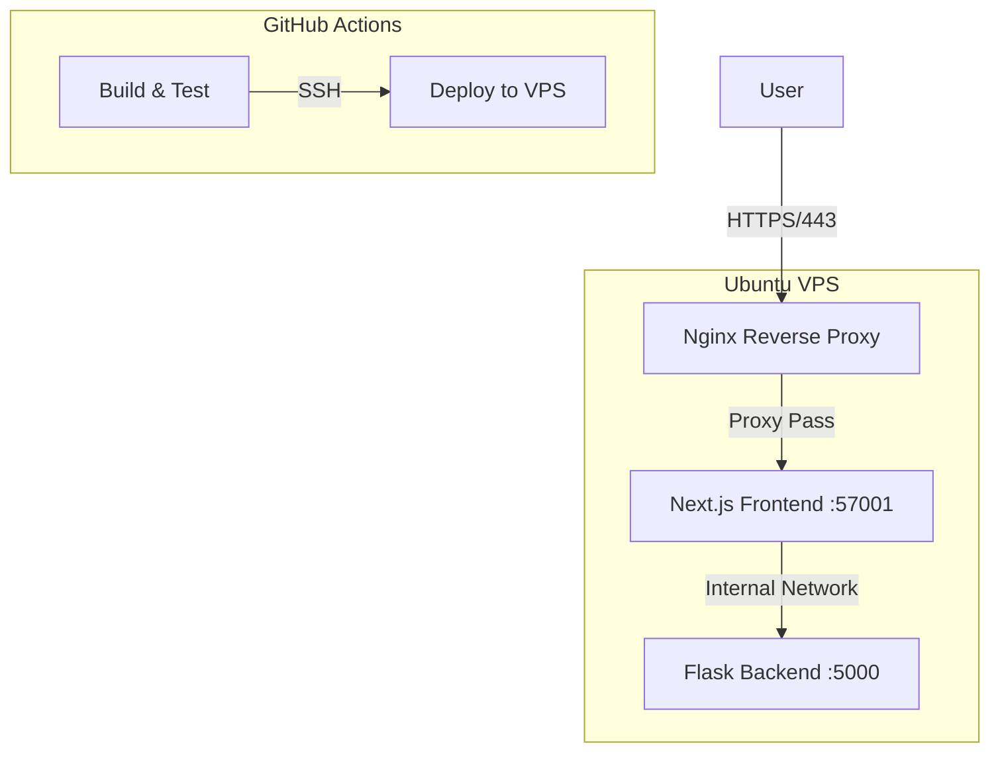

# DevOps Learning Project

A complete DevOps playground featuring a Next.js frontend, Flask backend, Docker containerization, and Infrastructure as Code (IaC) with Terraform and Ansible.

## Architecture

## Components

- **Frontend**: Next.js 14 (App Router) with Tailwind CSS & Framer Motion.
- **Backend**: Flask API with Prometheus metrics.
- **Infrastructure**:
  - **Docker Compose**: Orchestrates the application containers.
  - **Terraform**: Deploys the Docker stack to the VPS via SSH (Password Auth).
  - **Ansible**: Configures the VPS (installs Docker, Nginx, Certbot) and manages SSL.

## Quick Start

### Prerequisites
- Docker & Docker Compose
- Terraform
- Ansible
- A VPS (Ubuntu recommended)

### Setup
1. **Configure Ansible**: Update `ansible/inventory.ini` with your VPS details.
2. **Run Ansible**: `ansible-playbook -i ansible/inventory.ini ansible/playbook.yml`
3. **Deploy App**: Update `terraform/terraform.tfvars` and run `terraform apply`.

See [Setup Guide](guides/setup_guide.md) for detailed instructions.
